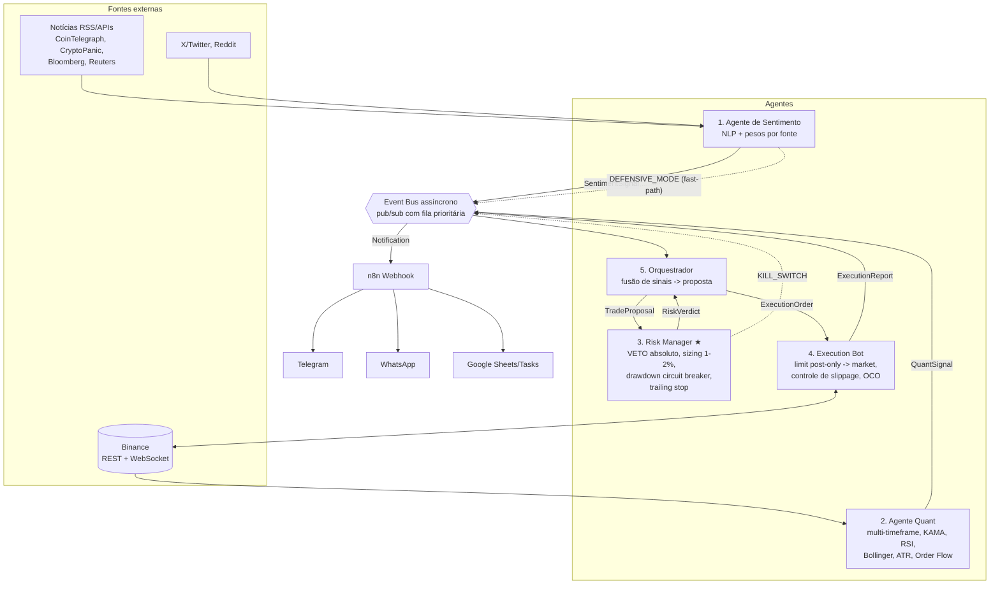

# Ecossistema Multi-Agente de Trading — Binance

Sistema modular de trading algorítmico com **preservação de capital como
objetivo nº 1**: controle absoluto de drawdown, position sizing estrito e
veto obrigatório de um Risk Manager antes de qualquer ordem.

> ⚠️ **Aviso**: material educacional/de pesquisa. Trading de criptoativos
> envolve risco de perda total. Rode em **testnet** e paper trading por
> semanas antes de considerar capital real, e só arrisque o que pode perder.

## Arquitetura



### Como os agentes se comunicam

- **Event Bus pub/sub em `asyncio`** (`core/event_bus.py`): cada agente
  assina tópicos e publica eventos tipados (`core/events.py`). Nenhum
  agente chama outro diretamente — desacoplamento total.
- **Fila prioritária**: `KILL_SWITCH` e `DEFENSIVE_MODE` furam a fila e
  descartam sinais comuns se necessário. Sinais de mercado têm **TTL**
  (sinal atrasado é sinal errado) e filas têm tamanho máximo.
- **Escala horizontal**: a interface do bus permite trocar o transporte
  in-process por **Redis Streams/RabbitMQ** sem alterar os agentes, caso
  os agentes precisem rodar em processos/máquinas separados.

### Pipeline de decisão (nenhum atalho possível)

```
Sentimento + Quant -> Orquestrador (fusão/convicção)
    -> TradeProposal -> Risk Manager (6 camadas de checagem)
        -> veto: fim.
        -> aprovado (com sizing e stops IMPOSTOS pelo Risco)
            -> Execution Bot (limit post-only -> fallback market com teto de slippage)
                -> OCO stop+alvo criado NA EXCHANGE
                -> ExecutionReport -> todos (auditoria + notificação)
```

O Risk Manager também roda dois vigias independentes: **watchdog de
drawdown** (relê o equity real da conta a cada 30 s e aciona o kill switch
sozinho) e **trailing stop** (só aperta, nunca afrouxa).

## Estrutura do código

```
trading-system/
├── main.py                     # boot, supervisão e shutdown gracioso
├── core/
│   ├── events.py               # contratos de mensagens entre agentes
│   ├── event_bus.py            # pub/sub assíncrono com prioridade
│   ├── state.py                # estado global (equity, drawdown, posições)
│   └── config.py               # YAML p/ estratégia, env p/ segredos
├── agents/
│   ├── base.py                 # supervisão, heartbeat, reinício c/ backoff
│   ├── sentiment_agent.py      # 1. notícias + NLP + gatilho catastrófico
│   ├── quant_agent.py          # 2. multi-timeframe + order flow
│   ├── risk_agent.py           # 3. veto, sizing, circuit breakers ★
│   ├── execution_agent.py      # 4. execução inteligente + emergência
│   └── orchestrator_agent.py   # 5. fusão de sinais e decisão final
├── exchange/
│   ├── binance_client.py       # ccxt + retry/backoff + OCO na exchange
│   └── ws_manager.py           # WebSocket com reconexão e watchdog
├── notifications/
│   ├── notifier.py             # ponte Event Bus -> webhook n8n
│   └── n8n_workflow.json       # template do fluxo n8n (Telegram/WhatsApp/Sheets)
├── backtest/strategy_backtrader.py  # espelho da estratégia p/ validação
└── config/config.yaml          # parâmetros de risco e estratégia
```

## Segurança na API da Binance

1. **API key mínima**: leitura + spot trading. **Saque sempre desabilitado**
   e **IP whitelisting** obrigatório.
2. Segredos só em `.env`/secret manager (o `.gitignore` já exclui `.env`).
3. `enableRateLimit` no ccxt + retry com backoff exponencial (2s→16s),
   distinguindo erros recuperáveis (rede/429) de fatais (auth/fundos —
   nunca retentar ordem, risco de duplicação).
4. WebSocket com reconexão + jitter, watchdog de silêncio (conexão zumbi),
   ressincronização via REST após reconectar e **modo defensivo automático**
   se ficar cego por >2 min.
5. Stops **na exchange (OCO)**, não só na memória: se o bot cair, a posição
   continua protegida.
6. `testnet: true` por padrão; produção exige mudança explícita.
7. Shutdown gracioso: SIGTERM cancela ordens abertas antes de sair.

## Camadas de proteção de capital (Risk Manager)

| # | Checagem | Ação |
|---|----------|------|
| 1 | Kill switch / modo defensivo | veto |
| 2 | Drawdown diário ≥ 3% ou semanal ≥ 8% | veto + kill switch (fecha posições) |
| 3 | 4 perdas seguidas / 10 trades no dia | veto (anti-tilt/overtrading) |
| 4 | Stop ausente, invertido ou R:R < 1.5 | veto |
| 5 | Position sizing | risco fixo de 1% do equity pela distância do stop |
| 6 | Exposição > 10% do capital ou > 3 posições | corta tamanho / veto |

## Integração n8n (Telegram / WhatsApp / Sheets)

O bot envia **um único** `HTTP POST` (`notifications/notifier.py`) para o
webhook do n8n com `{level, title, body, payload}`. O fluxo
(`notifications/n8n_workflow.json`) roteia:

- `critical` → Telegram com som + WhatsApp (Twilio) — kill switch, falha de execução;
- `warning` → Telegram — slippage abortado, fonte de dados fora;
- `info` → Telegram silencioso + linha no Google Sheets (diário de trades).

Um segundo fluxo no n8n (Schedule Trigger, 5 min) consulta a saúde do bot
e alerta se algum agente parar de emitir heartbeat — monitoramento externo
ao próprio bot.

## Como rodar

```bash
cd trading-system
python -m venv .venv && source .venv/bin/activate
pip install -r requirements.txt
cp .env.example .env   # preencha as chaves (testnet primeiro!)
python main.py
```

Backtest: `python backtest/strategy_backtrader.py --symbol BTC/USDT --tf 1h`

## Roadmap de produção

1. Backtest (custos + slippage realistas) → 2. Testnet/paper por semanas →
3. Capital mínimo com `max_risk_per_trade_pct: 0.5` → 4. Escala gradual
somente com drawdown observado dentro do previsto.
